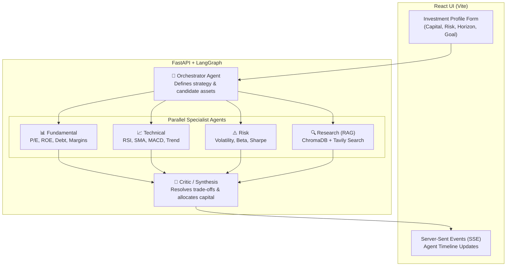

# 💼 Multi-Agent AI Portfolio Investment Advisor


A cutting-edge, open-source **Multi-Agent AI Finance System** designed to act as your personal algorithmic investment advisor. Built with **LangGraph**, **FastAPI**, and **React**, this project demonstrates how specialized AI agents can collaborate in a stateful workflow to analyze financial markets, manage risk, and synthesize a comprehensive portfolio allocation strategy.

> **Primary Use Case:**
> *"I have ₹10,000 to invest. Where should I consider investing based on my moderate risk tolerance, medium-term horizon, and goal of balanced growth?"*

The system runs locally and operates **100% for free** by integrating with generous free-tier cloud APIs: **Groq** for high-speed open-weights LLM inference, **ChromaDB** for local RAG embeddings, and **yfinance** for real-time market data.

---

## 🌟 Key Features

- **🤖 6-Agent Collaborative Workflow**: A master Orchestrator manages 4 parallel specialist agents (Fundamental, Technical, Risk, Research) and a final Critic for synthesis.
- **📚 Local RAG (Retrieval-Augmented Generation)**: Uses a locally hosted ChromaDB vector store (`all-MiniLM-L6-v2`) to ground the AI in factual sector intelligence and modern portfolio theory.
- **⚡ Real-Time Market Data**: Pulls live price action, valuation multiples, and moving averages via Yahoo Finance APIs.
- **📰 Live News Search**: Integrates Tavily Search for real-time market sentiment and breaking news.
- **🎨 Interactive UI**: A beautiful, dark-mode React frontend with interactive forms, preset investment profiles, live agent progress streaming, and visual portfolio allocation bars.

---

## 🏗️ System Architecture

The backend is powered by **LangGraph**, defining a stateful, cyclical multi-agent graph where each agent is an independent node that reads from and writes to a shared `AgentState`.



### Deep Dive: How the Flow Works

The architecture relies on a **LangGraph StateGraph**. You can think of the "State" as a shared whiteboard that all the agents can read from and write to as the process moves forward.

#### 1. The State Initialization
When the backend receives your request (e.g., *₹10,000, High Risk, Short Horizon, Aggressive Goal*), it initializes the `AgentState`. The whiteboard now holds your profile, but the candidate assets list and allocation plan are completely empty.

#### 2. Node 1: The Orchestrator
The graph routes first to the Orchestrator. 
* **Input**: It reads your profile from the whiteboard.
* **Process**: It queries the Groq LLM to act as a Master Strategist. Based on your inputs, it formulates a macro strategy and selects 3 to 5 highly liquid candidate assets. 
* **Output**: It writes these chosen tickers to the `candidate_assets` array on the whiteboard.

#### 3. The Fan-Out (Parallel Execution)
LangGraph now enters a "fan-out" phase. It sees the chosen candidate assets and wakes up four specialized agents simultaneously. All four agents run concurrently:
* 📊 **Fundamental Agent**: Uses `yfinance` to download real balance sheets and income statements. Calculates P/E, ROE, Debt-to-Equity, and Margins to determine intrinsic financial health.
* 📈 **Technical Agent**: Downloads 1 year of daily closing prices via `yfinance`. Runs deterministic mathematical formulas to calculate RSI (14-day), SMAs (50/200-day), and MACD momentum to time the market entry.
* ⚠️ **Risk Agent**: Downloads benchmark index data (e.g., Nifty 50 `^NSEI`). Calculates Beta, Annualized Volatility, and Max Drawdowns to see if the asset actually aligns with your "Risk Tolerance".
* 🔍 **Research (RAG) Agent**: Searches your local **ChromaDB** vector database for matching sector knowledge, and pings the **Tavily API** for live, breaking news with cited sources.

#### 4. The Fan-In (Convergence)
Once all four parallel agents finish writing their massive data reports to the whiteboard, LangGraph moves to the final node.

#### 5. Node 5: The Critic / Synthesis
* **Process**: The Critic acts as the Chief Investment Officer. It cross-references the data to resolve conflicts (e.g., *a stock might have great news but is mathematically overbought based on RSI*).
* **Output**: The Critic constructs a strict JSON object containing a `100% Capital Allocation Plan`. It calculates exact monetary amounts for each asset based on conviction and risk limits.

#### 6. The Frontend Stream
While this happens, the FastAPI backend uses **Server-Sent Events (SSE)** to stream the status of the graph directly to your React UI in real-time, ending with the finalized visual allocation cards.

---

## 📂 Project Structure

```text
AI Finance Planner/
├── microDB/
│   ├── backend/
│   │   ├── app/
│   │   │   ├── agents/          # Individual agent logic (orchestrator, critic, etc.)
│   │   │   ├── api/             # FastAPI routes & SSE streaming
│   │   │   ├── graph/           # LangGraph workflow definition
│   │   │   ├── models/          # Pydantic schemas and State definitions
│   │   │   ├── rag/             # ChromaDB vector store and ingestion scripts
│   │   │   └── config.py        # Environment and LLM config
│   │   ├── chroma_db/           # Local persistent vector database
│   │   ├── requirements.txt
│   │   └── .env                 # API Keys
│   │
│   └── frontend/
│       ├── src/
│       │   ├── components/      # React components (ChatInput, AnalysisReport)
│       │   ├── hooks/           # Custom hooks (useAnalysis)
│       │   ├── types/           # TypeScript interfaces
│       │   ├── App.tsx          # Main layout
│       │   └── index.css        # Tailwind config & CSS variables
│       ├── package.json
│       └── vite.config.ts
```

---

## 🚀 Quick Start Guide

### 1. Prerequisites
- Python 3.10+
- Node.js 18+
- [Groq API Key](https://console.groq.com) (Free)
- [Tavily API Key](https://app.tavily.com) (Free)

### 2. Backend Setup
```bash
cd backend
python -m venv venv

# Activate Virtual Environment
venv\Scripts\activate      # Windows
# source venv/bin/activate # macOS/Linux

# Install dependencies
pip install -r requirements.txt

# Configure Environment Variables
cp .env.example .env
# Edit .env and add your GROQ_API_KEY and TAVILY_API_KEY
```

**Seed the Knowledge Base (One-Time Setup):**
To power the RAG agent, you need to seed the ChromaDB vector store. This will automatically download the local embedding model (`all-MiniLM-L6-v2`) and ingest the seed documents.
```bash
python -c "from app.rag.ingest import seed_knowledge_base; seed_knowledge_base()"
```

**Run the API:**
```bash
uvicorn app.main:app --reload --port 8000
```

### 3. Frontend Setup
```bash
cd frontend
npm install
npm run dev
```

The frontend will be available at [http://localhost:5173](http://localhost:5173). 

---

## 🛠️ Tech Stack Details

- **Backend Framework**: FastAPI
- **Agent Orchestration**: LangGraph, LangChain
- **LLM Engine**: Groq (`openai/gpt-oss-120b` or Llama 3 models)
- **Vector Database**: ChromaDB (Running locally with SentenceTransformers)
- **Financial Data**: `yfinance`
- **News Search**: Tavily API
- **Frontend Framework**: React 18, Vite
- **Styling**: Tailwind CSS, Lucide Icons
- **Communication**: Server-Sent Events (SSE) for streaming LangGraph node transitions to the UI.

---

## ⚠️ Disclaimer
**This project is for educational and demonstrative purposes only.** The AI-generated portfolio allocations and financial analyses are purely hypothetical. Do not use this system to make actual financial or investment decisions. Always consult with a certified financial advisor before investing.
